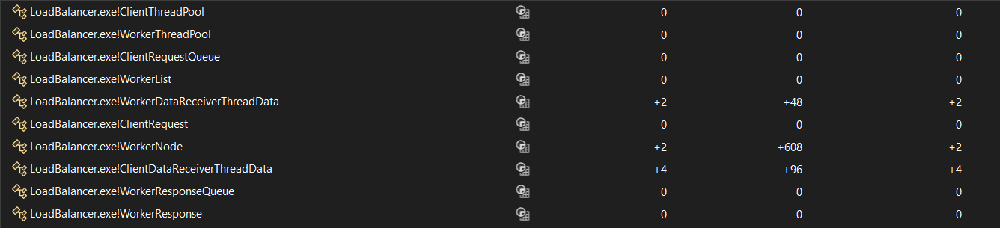

# Load Balancer

## Design

## Documentation

### Client

* Connects to the Load Balancer via TCP on port 5059  
* Sends and retrieves data to the Load Balancer via the Sender Thread  
* Waits for responses via the Receiver Thread

#### Threads:

* Main thread  
* Data receiver thread  
* Data sender thread  
* Input thread

---

### Load Balancer

* Listens for client connections via the Client Listener Thread  
* When a new client has connected borrows a Client Data Receiver Thread from the Client Thread Pool  
* Publishes the clients request to a blocking Request Queue  
* Worker-Client Request Dispatcher Thread subscribes to the Request Queue and when a new request appears it gets the next Worker (Round Robin algorithm) from the Worker List and sends the data to the Worker  
* When a new Worker connects the Worker Listener thread registers it by adding it to the Worker List and borrows a Worker Listener Thread from the Worker Thread Pool  
* When a new Worker is registered all other Workers are notified so they can open a TCP connection to the newly connected Worker, one of the notified workers also receives a request for full data export to the newly connected Worker  
* When a Worker disconnects the Worker Manager thread unregisters it by removing it from the Worker List  
* The Worker Data Receiver thread waits for Worker notifications and when it receives a notification from a Worker it puts it to a blocking Response Queue where the Client-Worker Response Dispatcher Thread delivers the response to the Client

#### Threads:

* Main thread  
* Client listener thread  
* N \* Client data receiver thread  
* Worker-client request dispatcher thread  
* Worker listener thread  
* N \* Worker data receiver thread  
* Client-worker response dispatcher thread  
* Input thread

#### Data structures:

* Blocking queue for Client requests and responses (like a circular buffer but instead of overwriting data when it overflows, it blocks)  
* Circular doubly linked list for Workers with a Round Robin pointer (so we can easily add/remove Workers)  
* Thread pools for Client and Worker data receiver threads

---

### Worker

* Connects to the Load Balancer and listens for data storage requests via the Receiver Thread  
* When data is received on the Receiver Thread it inserts the data into a HashMap  
* The Receiver Thread sends a notification to the Load Balancer when the data is stored and also broadcasts the data to its peers via the Peer Manager  
* The Receiver Thread also gets notified about new peers by the Load Balancer and optionally the message may contain a flag that requests that the worker sends all of its data to the new peer  
* A Peer Listener Thread listens for messages from its peers they can be full data exports when the worker is fresh or data sync while the worker is ready and running

#### Threads:

* Main thread  
* Receiver thread  
* Export thread  
* Peer Listener thread  
* Input thread

#### Data structures:

* A HashMap to store client data (simple key-value store)  
* A static array to store data about peers  
* A simple queue for storing export data requests

## Protocol

All messages start with a header:
- `type` (1 byte, MessageType)
- `length` (2 bytes, payload size, not including header)

---

| Message Type                | Payload Fields                                                                                   |
|----------------------------|-------------------------------------------------------------------------------------------------|
| **MSG_PUT**                | `keyLen` (2), `key` (keyLen), `valueLen` (2), `value` (valueLen)                                 |
| **MSG_PUT_RESPONSE**       | `result` (1), `keyLen` (2), `key` (keyLen)                                                      |
| **MSG_GET**                | `keyLen` (2), `key` (keyLen)                                                                    |
| **MSG_GET_RESPONSE**       | `result` (1), `keyLen` (2), `key` (keyLen), `valueLen` (2), `value` (valueLen, if > 0)          |
| **MSG_STORE_REQUEST**      | `clientId` (4), `keyLen` (2), `key` (keyLen), `valueLen` (2), `value` (valueLen)                |
| **MSG_STORE_RESPONSE**     | `result` (1), `clientId` (4), `keyLen` (2), `key` (keyLen)                                      |
| **MSG_RETRIEVE_REQUEST**   | `clientId` (4), `keyLen` (2), `key` (keyLen)                                                    |
| **MSG_RETRIEVE_RESPONSE**  | `result` (1), `clientId` (4), `keyLen` (2), `key` (keyLen), `valueLen` (2), `value` (valueLen, if > 0) |
| **MSG_WORKER_REGISTRY_START** | `totalWorkers` (4)                                                                           |
| **MSG_WORKER_ENTRY**       | `workerId` (4), `addrLen` (2), `address` (addrLen), `port` (2), `shouldExportData` (1)          |
| **MSG_WORKER_REGISTRY_END**| (no payload)                                                                                      |
| **MSG_DATA_EXPORT_START**  | `totalEntries` (4)                                                                              |
| **MSG_DATA_ENTRY**         | `keyLen` (2), `key` (keyLen), `valueLen` (2), `value` (valueLen)                                |
| **MSG_DATA_EXPORT_END**    | (no payload)                                                                                      |
| **MSG_WORKER_READY**       | `workerId` (4), `peerPort` (2)                                                                  |
| **MSG_WORKER_NOT_READY**   | `workerId` (4)                                                                                  |
| **MSG_PEER_NOTIFY**        | `keyLen` (2), `key` (keyLen), `valueLen` (2), `value` (valueLen)                                |
| **MSG_SHUTDOWN**           | (no payload)                                                                                      |
| **MSG_ERROR**              | `errorCode` (1), `messageLen` (2), `message` (messageLen, if > 0)                               |

## Test

### Step 1: Just the Load Balancer is started and waiting for a key press

Heap:  
  

Process Monitor:
  

### Step 2: After the memory allocations are done and threads are started

Heap:  
  

Allocations:  
  

Process Monitor:  
  

### Step 3: 2 workers are started and the Load Balancer is waiting for clients

Heap:  
  

Allocations:  
  

Process Monitor:  
  

### Step 4: 3 clients are connected and the Load Balancer is under stress distributing requests

Heap:  
  

Allocations:  
  

Process Monitor:  
  

### Step 5: The clients are disconnected and the Load Balancer is passive

Heap:  
  

Allocations:  
  

### Step 6: All workers are disconnected and the Load Balancer is stopped, memory deallocated and threads finished, waiting for a key press just before the final exit

Heap:  
  

Allocations:  
  

Process Monitor:  
  

## Potential improvements

- `WorkerClientRequestDispatcherThread` can be improved by waiting for 2 signals on each iterator.  
  One for getting the next message and another for getting the next worker.  
  This would require changing the API of both data structures to allow for calling take and get without them using `WaitForSingleObject` internally.  
- We use multiple threads for handling worker notifications because assume that the number of workers will be small and the number of notifications high.  
  This allows us to handle many notifications at the same time.  
  If the number of workers was large, we should use a single thread that uses a `fd_set` to receive notifications from all workers by utilizing non-blocking sockets.  
- We use multiple threads for handling client requests because we assume that the number of clients will be small and the number of requests high.  
  This allows us to handle many requests at the same time.  
  If the number of clients was large, we should use a single thread that uses a `fd_set` to receive requests from all clients by utilizing non-blocking sockets.  
- Previous two points also show that we are in fact not using thread pooling but creating and assigning threads dedicated to clients and workers as needed. Which
  is not an issue with a low number of clients/workers and depends on if we're trying to emulate something like Redis/Nginx which doesn't rely on multiple threads
  or something like MySQL where each client gets a dedicated thread.